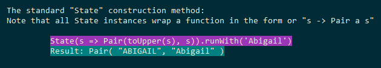

# :game_die: __Playing around with the State monad__

&nbsp;

### :mortar_board: __Show me the learnings__

**1.** Clone repo:

**`❍ git clone https://github.com/gskapka/state-monad.git`**

**2.** Switch to repo

**`❍ cd state-monad`**

**3.** Run in node to see it in all its glory!

**`❍ node state`**

&nbsp;

***

&nbsp;

## :rainbow: Bask in the 16bit color glory:

&nbsp;

***
